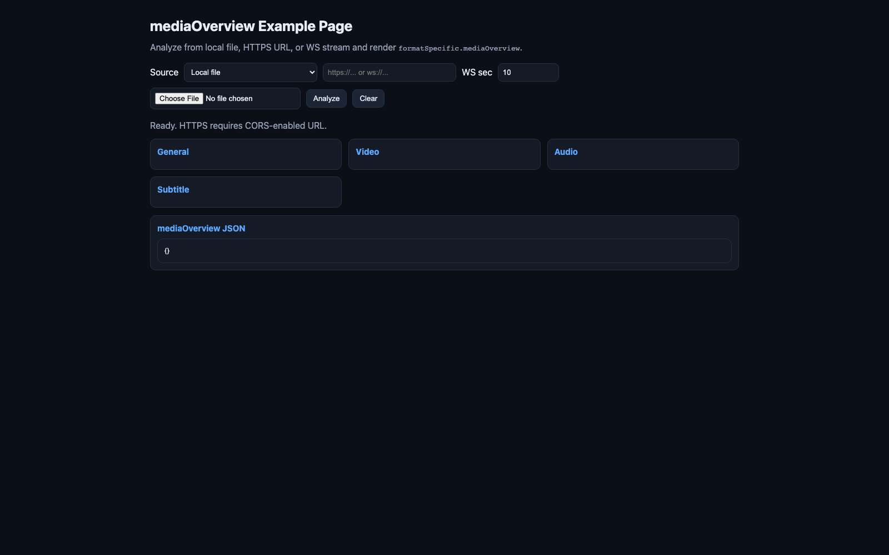
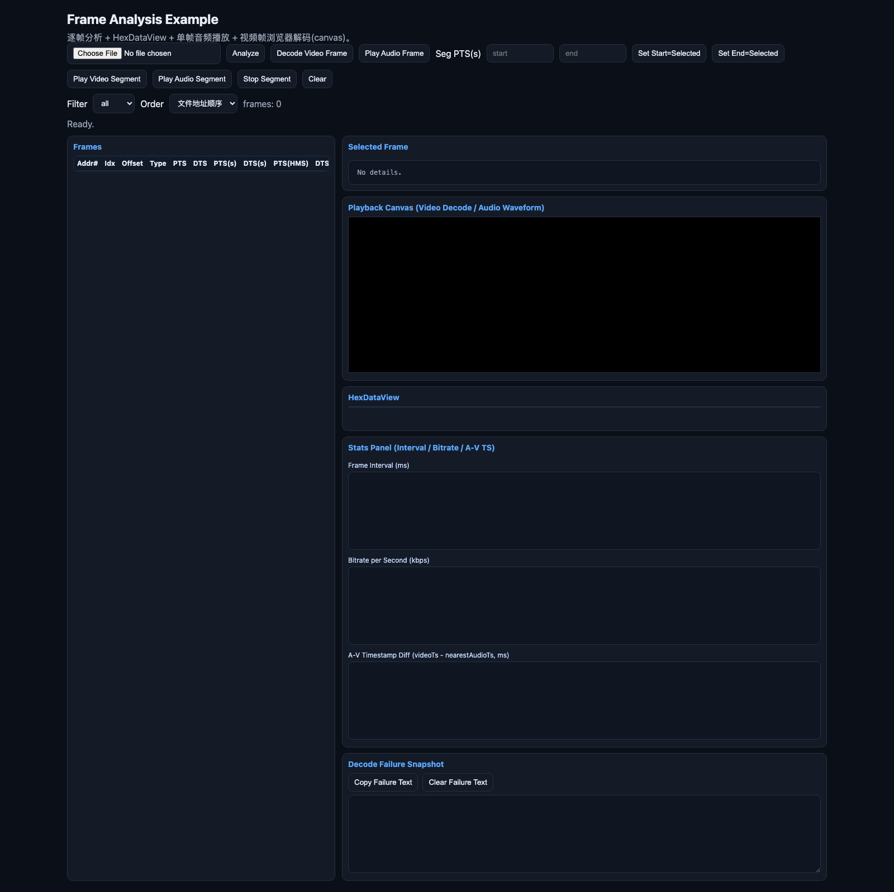

# media-analyzer

`media-analyzer` 是一个媒体解析与浏览器侧分析工具集合，包含：

- `lib/`：可复用的解析与播放能力（MP4/FLV/TS/PS、多格式帧适配、浏览器解码辅助）
- `examples/`：示例页面（媒体总览、逐帧分析）

## 快速开始

本目录为纯源码与静态示例，不依赖 npm。

## 架构文档

- [项目架构与逻辑](./docs/architecture.md)
- [架构复核与当前缺陷](./docs/architecture-review.md)

## 仓库与在线示例

- GitHub 仓库：[icradP/media-analyzer](https://github.com/icradP/media-analyzer/)
- 在线示例首页（GitHub Pages）：[https://icradp.github.io/media-analyzer/](https://icradp.github.io/media-analyzer/)
- 在线示例（media-overview）：[https://icradp.github.io/media-analyzer/examples/media-overview-demo.html](https://icradp.github.io/media-analyzer/examples/media-overview-demo.html)
- 在线示例（frame-analysis）：[https://icradp.github.io/media-analyzer/examples/frame-analysis-demo.html](https://icradp.github.io/media-analyzer/examples/frame-analysis-demo.html)

## 测试解析通过项

- [x] ts(h264/aac)
- [ ] ts(h265/aac)
- [ ] ts(h264/mp3)
- [ ] ts(h265/mp3)
- [x] mp4(h264/aac)
- [x] mp4(h265/aac)
- [ ] mp4(h264/mp3)
- [ ] mp4(h265/mp3)
- [ ] flv(h264/aac)
- [ ] flv(h265/aac)
- [ ] flv(h264/mp3)
- [ ] ps(h264/aac)
- [ ] ps(h265/aac)
- [ ] 裸流(h264)
- [ ] 裸流(h265)

## 使用示例

### 1) 打开示例页面

在项目根目录启动静态服务：

```bash
python3 -m http.server 8080
```

然后在浏览器打开：

- `http://127.0.0.1:8080/examples/media-overview-demo.html`
- `http://127.0.0.1:8080/examples/frame-analysis-demo.html`

### 2) 在代码中调用统一分析入口

```js
import { analyzeByDetectedFormat } from "./lib/codec/analyzeByDetectedFormat.js";

const bytes = new Uint8Array(await file.arrayBuffer());
const result = await analyzeByDetectedFormat(bytes, {
  fileMeta: { fileName: file.name, fileSize: file.size }
});

console.log(result.format?.formatName);
console.log(result.streams);
console.log(result.frames?.length);
```

## 示例页面截图

### media-overview-demo



### frame-analysis-demo


