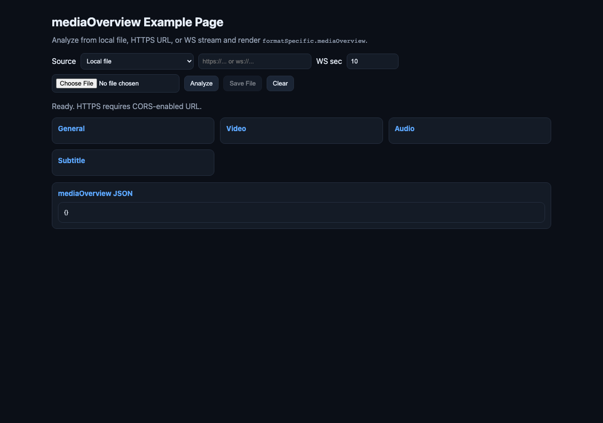
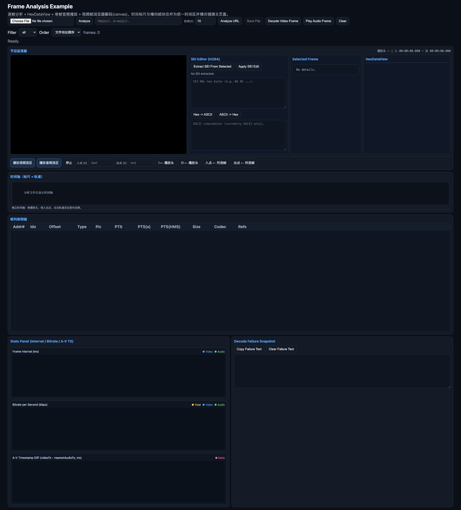

# media-analyzer

`media-analyzer` 是一个纯前端可用的媒体解析、帧分析和浏览器侧播放工具集合。源码以原生 ESM 组织，静态示例页可以直接加载 `lib/`，前端部分不依赖 npm 构建。

## 当前能力

- `lib/codec/`：FLV、MPEG-TS、MPEG-PS、MP4/fMP4、WAV、FLAC、Ogg Opus、MP3 的轻量分析入口，以及 H.264/H.265 NAL、SPS/PPS/VPS、SEI、slice、AAC、G.711 等解析工具。
- `lib/browser/`：帧列表、HexDataView、字段高亮、参考帧关系、WebCodecs 解码、tinyh264 fallback、WebAudio 播放和 H.264 SEI 编辑模型。
- `lib/player/`：基于分析结果的 Canvas/MSE 播放链路，支持选区播放、时间线和直播 FLV MSE 管线。
- `lib/streaming/`：HTTP(S) 文件读取、WebSocket 二进制采集、WS-FLV 播放、RTMP sidecar 唤起与采集桥接。
- `tools/rtmp-sidecar/`：本地 RTMP 拉流 sidecar，不转码，负责把 RTMP audio/video/script message 重新封装为本地 WS-FLV。
- `examples/`：媒体总览、逐帧分析和播放器三个静态示例页。

## 快速开始

在项目根目录启动静态服务：

```bash
python3 -m http.server 8080
```

然后在浏览器打开：

- `http://127.0.0.1:8080/examples/media-overview-demo.html`
- `http://127.0.0.1:8080/examples/frame-analysis-demo.html`
- `http://127.0.0.1:8080/examples/player-demo.html`

RTMP 输入需要本地 sidecar：

```bash
node tools/rtmp-sidecar/server.mjs
```

macOS 开发调试时，也可以注册 `media-analyzer://` URL scheme：

```bash
tools/rtmp-sidecar/register-macos-url-scheme.sh
```

## 仓库与在线示例

- GitHub 仓库：[icradP/media-analyzer](https://github.com/icradP/media-analyzer/)
- 在线示例首页（GitHub Pages）：[https://icradp.github.io/media-analyzer/](https://icradp.github.io/media-analyzer/)
- 在线示例（media-overview）：[media-overview-demo.html](https://icradp.github.io/media-analyzer/examples/media-overview-demo.html)
  - 本地文件、HTTP(S)、WS、RTMP 输入。
  - 展示 `formatSpecific.mediaOverview` 的 General / Video / Audio / Subtitle 摘要。
  - 支持保存 WS/RTMP 采集到的媒体文件。
- 在线示例（frame-analysis）：[frame-analysis-demo.html](https://icradp.github.io/media-analyzer/examples/frame-analysis-demo.html)
  - 本地文件、HTTP(S)、WS、RTMP 输入。
  - 帧列表、媒体类型过滤、文件地址/时间排序、字段树、HexDataView、统计图、单帧解码和音频播放。
  - H.264 SEI 读取：从选中视频帧提取 SEI NAL，解析 payloadType、payloadSize、UUID/prefix 和可编辑 payload。
  - FLV/H.264 SEI 编辑：支持 payload Hex/ASCII 编辑、替换已有 SEI、向 FLV AVC frame 插入 SEI，并更新 FLV `dataSize` / `PreviousTagSize` 后导出 patched 文件。
  - 视频选区播放支持 WebCodecs，失败时回退到 tinyh264 worker。
- 在线示例（player）：[player-demo.html](https://icradp.github.io/media-analyzer/examples/player-demo.html)
  - 分析驱动播放器，展示 Source / Streams / Timeline / Playback Log。
  - 支持 Canvas 逐帧播放、MSE 播放、WS-FLV Live MSE 和 RTMP sidecar 输入。

## 测试解析通过项

以下清单记录当前维护的解析或编辑通过项；未勾选项表示代码可能已有部分能力，但还没有固定样本回归确认。

- [x] ts(h264/aac)
- [ ] ts(h265/aac)
- [ ] ts(h264/mp3)
- [ ] ts(h265/mp3)
- [x] mp4(h264/aac)
- [x] mp4(h265/aac)
- [ ] mp4(h264/mp3)
- [ ] mp4(h265/mp3)
- [x] flv(h264/aac)
- [ ] flv(h265/aac)
- [ ] flv(h264/mp3)
- [ ] ps(h264/aac)
- [ ] ps(h265/aac)
- [ ] 裸流(h264)
- [ ] 裸流(h265)
- [x] sei(h264) 读取与 payloadType 解析
- [x] flv(h264) SEI 替换、插入和保存导出
- [x] ws-flv / rtmp sidecar 采集后进入统一分析入口

## 编译与验证

本仓库前端为原生 ESM 静态源码，没有 npm build 步骤。推荐提交前做两类检查：

```bash
node --input-type=module -e "await import('./lib/codec/index.js'); await import('./lib/browser/index.js'); await import('./lib/mpegTs/index.js'); await import('./lib/mpegPs/index.js'); await import('./lib/player/index.js'); await import('./lib/streaming/index.js'); console.log('ESM import check passed');"
git diff --check
```

需要验证页面时，启动静态服务后打开上面的三个示例页，分别覆盖 overview、frame list / SEI editor / HexDataView、播放器与 MSE 路径。

## 代码调用示例

```js
import { analyzeByDetectedFormat } from "./lib/codec/analyzeByDetectedFormat.js";

const bytes = new Uint8Array(await file.arrayBuffer());
const result = await analyzeByDetectedFormat(bytes, {
  fileMeta: { fileName: file.name, fileSize: file.size }
});

console.log(result.format?.formatName);
console.log(result.streams);
console.log(result.frames?.length);
```

## 架构文档

- [项目架构与逻辑](./docs/architecture.md)
- [架构复核与当前缺陷](./docs/architecture-review.md)
- [播放器模块说明](./examples/player-module.md)
- [RTMP sidecar 说明](./tools/rtmp-sidecar/README.md)

## 示例页面截图

### media-overview-demo



### frame-analysis-demo


