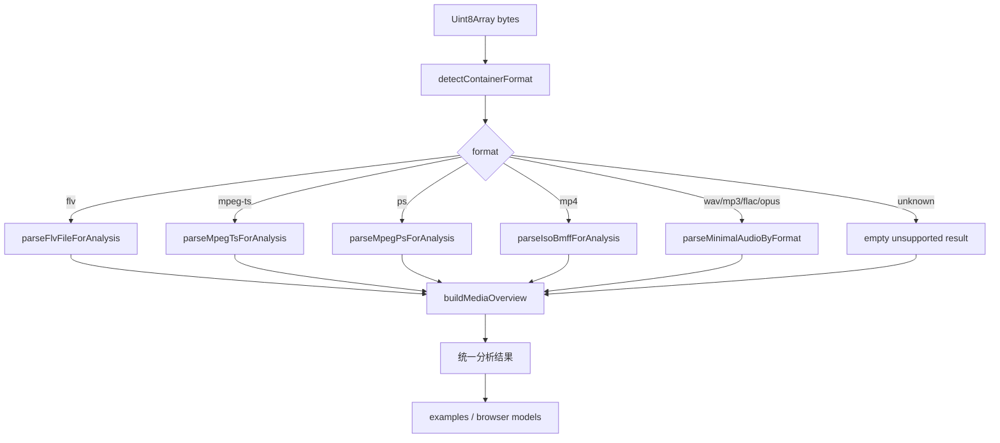
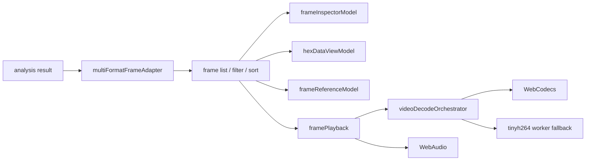

# media-analyzer 架构与逻辑

本文档整理当前项目的模块边界、统一数据模型和主要解析流程，方便后续继续扩展容器、编码格式和浏览器侧分析能力。

## 项目定位

`media-analyzer` 是一个纯前端可用的媒体解析与浏览器侧分析工具集合。项目不依赖 npm 构建，源码以原生 ESM 组织，示例页通过静态服务直接加载 `lib/` 下的模块。

核心目标是把不同输入格式解析成同一个分析结果形态：

```js
{
  format: {},          // 容器级信息：格式名、时长、码率、文件大小等
  streams: [],         // 流级信息：音频/视频/字幕轨，codec、分辨率、采样率等
  frames: [],          // 帧/样本/PES/tag 级时间线
  formatSpecific: {}   // 容器专有数据、原始 fileData、PAT/PMT、box tree、fieldOffsets 等
}
```

浏览器 UI、十六进制视图、帧详情、解码播放都围绕这个统一模型工作。

## 目录边界

- `lib/core/`
  基础能力层。`Be.js` 是带字段偏移记录的 bit reader，`MP4Parser.js` 是轻量 ISO-BMFF box 解析器，`FLVParser.js` 是兼容式 FLV 包装器，`mediaMath.js` 和 `displayLimits.js` 提供通用计算/显示常量。

- `lib/codec/`
  编码与容器解析能力层。包含 H.264/H.265 NAL/SPS/PPS/SEI/slice、AAC、G.711、FLV tag/body、统一分析入口 `analyzeByDetectedFormat.js` 和跨格式帧适配器 `multiFormatFrameAdapter.js`。`index.js` 是主聚合导出。

- `lib/mpegTs/`
  MPEG-TS 数据层。负责 TS 包长探测、transport packet 解析、PAT/PMT、descriptor、PES 组包、Annex-B 视频识别和 `parseMpegTsForAnalysis` 结果构建。

- `lib/mpegPs/`
  MPEG-PS 数据层。负责 start code 扫描、pack/system/program stream map/PES 解析，并把 PES 映射为统一的 streams/frames。

- `lib/streaming/`
  流式输入适配层。`wsStreamCapture.js` 负责 WebSocket 二进制采集与粗格式判断，`mp4ParserWsAdapter.js` 把 `MP4Parser` box tree 转为统一分析结果。

- `lib/browser/`
  浏览器侧模型与播放层。包含 frame list/hex view/inspector/reference model、WebCodecs 解码计划、音频播放、tinyh264 worker fallback 等。这个目录依赖浏览器 API，但尽量保持 UI 无关的数据处理函数。

- `lib/tinyh264/`
  H.264 wasm/worker fallback。用于 WebCodecs 无法解码时的帧预览兜底。

- `examples/`
  静态示例页。`media-overview-demo.html` 展示总览信息，`frame-analysis-demo.html` 展示逐帧列表、详情树、HexDataView、统计图和播放/解码操作，`player-demo.html` 展示基于 `lib/player` 的独立播放器页面。

## 主流程



统一入口是 `lib/codec/analyzeByDetectedFormat.js`：

1. 用文件头特征识别容器：FLV、MPEG-TS、PS、MP4、WAV、FLAC、Ogg Opus、MP3。
2. 分发到对应 parser，得到统一结果。
3. 追加 `formatSpecific.mediaOverview`，给总览页面直接消费。
4. 保留 `formatSpecific.fileData`，给 frame slicing、hex view、播放解码继续使用。

## 统一数据契约

### `format`

容器级摘要，常见字段有：

- `formatName` / `formatLongName`
- `duration`
- `bitrate`
- `size`
- TS 专有的 `packetSize` / `packetCount`
- FLV 专有的 `metadata`

### `streams[]`

流级摘要，常见字段有：

- `index`
- `codecType`: `video` / `audio` / `subtitle` / `data`
- `codecName`
- `duration` / `bitrate`
- 视频：`width`、`height`、`frameRate`、`profile`、`level`、`chroma`、`bitDepth`
- 音频：`sampleRate`、`channels`、`channelLayout`、`sampleFormat`
- 源追踪：FLV 的 `StreamBuilder` 会写入 `_sources` / `_alternatives`

### `frames[]`

时间线项，按容器映射为 frame/sample/tag/PES：

- `index`
- `streamIndex`
- `mediaType`
- `codecName`
- `pts` / `dts`
- `ptsTime` / `dtsTime`
- `offset` / `size`
- `isKeyframe`
- `pictureType`
- `displayName`
- `formatSpecific`

浏览器播放依赖 `offset`、`size`、`formatSpecific.fileData` 或 `_assembledESData` 取出真实帧数据。

### `formatSpecific`

容器和 UI 辅助数据的挂载点：

- `fileData`: 原始输入字节，供二次切片和 hex view 使用
- `fieldOffsets`: 字段到字节/bit 范围的索引，供 inspector 高亮
- FLV: `header`、tag 专有字段、sequence header、script metadata
- TS: `pat`、`pmts`、`pids`、`packetCount`、`pesCount`
- MP4: `boxes`
- `mediaOverview`: 统一总览模型

## 各格式解析逻辑

### FLV

FLV 的核心链路是：

```text
parseFlvFileForAnalysis
  -> parseFlvFileHeader
  -> parseFlvTagAt
  -> parseFlvAudioTagBody / parseFlvVideoTagBody / parseFlvScriptTagBody
  -> buildFlvMetadataSummary
  -> buildFlvAnalysisResult
```

关键点：

- tag header 和 tag body 都记录 `fieldOffsets`，便于 UI 精确高亮。
- 视频支持 classic AVC/HEVC tag 和 Enhanced RTMP HEVC tag。
- 通过 sequence header 提取 AVC/HVCC、SPS/PPS/VPS，再补齐宽高、profile、level、bitDepth 等信息。
- script metadata、sequence header、实际 tag 统计会按优先级合并到 `streams`。
- 配置 tag 不参与有效媒体帧 interval 统计。

### MPEG-TS

TS 的核心链路是：

```text
detectMpegTsPacketSize / iterateTsTransportPackets
  -> parseMpegTsPatAndPmts
  -> pushTsPacketToPesAssembler
  -> TsFrameAssembler
  -> mergeFrameUnits
  -> buildMpegTsAnalysisResult
```

关键点：

- 先用 PAT/PMT 建立 PID 到 stream type 的映射；没有 PAT/PMT 时，会对 payload 起始为 PES start code 的 PID 做兜底。
- PES 按 PID 组包，再按 PTS、data alignment、AUD、H.264 frame_num/POC 等信息合成近似 access unit。
- 视频 ES 以 Annex-B 方式解析 H.264/H.265 NAL，抽取 picture type、SPS 信息、VCL 字节数。
- 大 TS 文件有 `TS_ANALYSIS_PACKET_LIMIT`，超过限制后只继续采样尾部 PTS 用于时长估计。
- frame 上保留 `_assembledESData`，浏览器播放可以直接喂给解码器。

### MPEG-PS

PS 的核心链路是：

```text
findNextPsStartCode
  -> parsePsPacketAt
  -> parsePesPacket
  -> buildMpegPsAnalysisResult
```

关键点：

- 支持 pack header、system header、program stream map、PES。
- PSM 的 stream type 和 PES payload 探测会共同决定 codecName。
- frame 以 PES 为主，时间戳按 90kHz 时基转成秒。

### MP4 / fMP4

MP4 的核心链路是：

```text
MP4Parser.parse
  -> parseBox / parseChildren / parseSTSD / parseBoxData
  -> parseIsoBmffForAnalysis
```

关键点：

- `MP4Parser` 负责轻量 box tree，重点解析 `stsd`、`avcC`、`hvcC`、`mvhd`、`mdhd`、`tkhd`、`elst`、`stsz`、`stco/co64`、`stsc`、`stts`、`ctts`、`stss`。
- `parseIsoBmffForAnalysis` 通过 track/sample table 生成 streams 和 sample 级 frames。
- 视频 profile/level/chroma/bitDepth 会优先从 avcC/hvcC 中的 SPS 解析。
- 当前是轻量分析，不完整解析每个 MP4 sample 内的 slice，因此非关键帧 picture type 默认按 P 帧估计。

### 纯音频

`audioMinimalAnalysis.js` 提供 WAV、FLAC、MP3、Ogg Opus 的轻量 header 级分析，返回音频流信息；目前不生成逐音频帧时间线。

## 浏览器侧逻辑



- `multiFormatFrameAdapter.js`
  把不同容器的 `frames[]` 归一为 UI 列表项，提供 filter、format/codec 获取。

- `hexDataViewModel.js`
  根据容器宽度生成十六进制行，支持字段高亮和 emulation-prevention byte 标记。

- `frameInspectorModel.js`
  从选中帧提取 NAL、FLV tag、TS/PES 字段、field offsets，并在必要时重新解析帧 payload。

- `frameReferenceModel.js`
  根据 slice header、POC/frame_num、picture type 推导 H.264/H.265 参考关系；无法精确推导时用近邻非 B 帧兜底。

- `framePlayback.js`
  构造视频 decode plan、提取 GOP、转换 Annex-B/length-prefixed、补 decoder config、封装 AAC ADTS、处理 G.711 PCM 解码并通过 WebAudio 播放。

- `videoDecodeOrchestrator.js`
  为 WebCodecs 生成 codec candidates，尝试多种 H.264 解码策略；失败时使用 tinyh264 worker fallback。

## 示例页数据流

### `media-overview-demo.html`

```text
file / http(s) / ws
  -> Uint8Array
  -> analyzeByDetectedFormat(bytes, { fileMeta })
  -> result.formatSpecific.mediaOverview
  -> General / Video / Audio / Subtitle cards
```

### `frame-analysis-demo.html`

```text
file / http(s) / ws
  -> Uint8Array
  -> analyzeByDetectedFormat
  -> resultMap = { [formatName]: result }
  -> getFrames / getFilteredFrames
  -> frame table + selected detail + hex view + stats + decode/playback
```

## 扩展新格式的建议步骤

1. 在对应目录实现纯数据 parser，输出统一 `{ format, streams, frames, formatSpecific }`。
2. 在 `detectContainerFormat` 增加格式探测。
3. 在 `analyzeByDetectedFormat` 增加分发，并保证 `formatSpecific.fileData` 存在。
4. 如需要帧列表展示，确认 `frames[]` 至少有 `index`、`mediaType`、`pts/dts` 或 `ptsTime/dtsTime`、`offset`、`size`。
5. 如需要 inspector 高亮，解析时记录 `fieldOffsets`。
6. 如需要播放/解码，补充 `framePlayback` 的 payload 提取、codec config 和浏览器 API 适配。
7. 在示例页用真实样本验证 overview、frame list、hex view、decode/playback。

## 当前边界

- 项目没有 npm 测试脚本，验证主要依赖静态示例页和模块导入检查。
- MP4 分析偏 sample table 级，不是完整 demux/decode。
- TS/PS 的 access unit 合并是启发式，复杂码流仍可能需要按具体样本继续修正。
- 纯音频格式目前只做 header 级总览，不做逐帧波形/时间线。
- 浏览器解码依赖 WebCodecs、WebAudio、Worker；不同浏览器和 codec 支持会影响结果。
